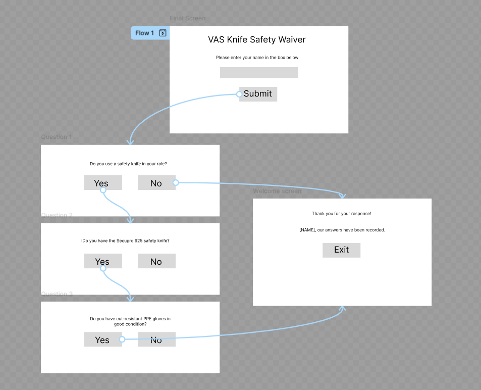
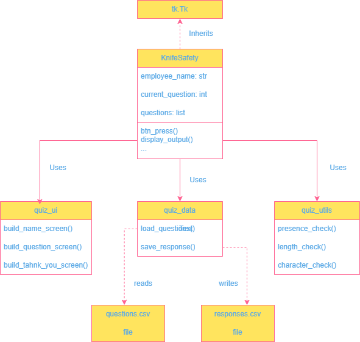
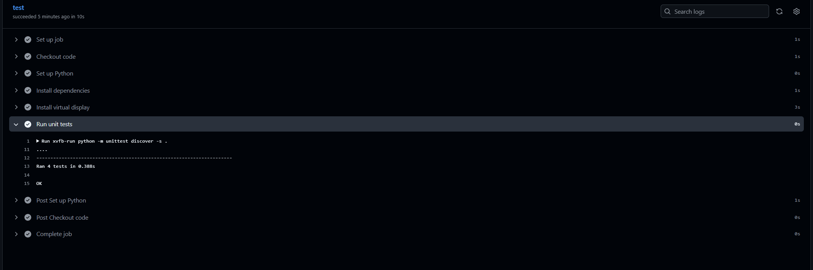
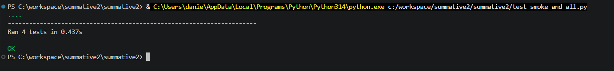

# Knife Safety and PPE Quiz

> Python version used: 3.14 

---

## Table of Contents

- [Introduction](#introduction)
- [Design](#design)
- [Development](#development)
- [Testing](#testing)
- [Documentation](#documentation)
- [Evaluation](#evaluation)

---

## Introduction

We are a supplier of PPE and tools, offering a one-stop shop for businesses purchasing consumable items. In this environment, stock is ordered in bulk and then distributed to various customers. As our customers do not require the large quantities in which stock is ordered, we need to be able to open and break down packaging. This is one of many uses for safety knives that a worker may face.

There have been a number of health and safety incidents involving a specific type of safety knife that was previously deemed appropriate for the job. In light of these incidents, tighter measures have been put in place requiring all employees to use appropriate cut-resistant gloves when handling these knives.

There is a need to make all staff, whether new starters or existing employees, aware of this policy change, and to ensure that relevant PPE is made available when safety knives are in use. Currently, discussions are being held and staff are required to sign to confirm their attendance. During these discussions, any PPE requirements are noted.

The quiz offers the functionality to track attendance and PPE requirements simultaneously, providing an official record that ensures compliance and that both parties are covered. The quiz will record the name of the person, the date and time they completed it, whether they use the relevant knife, and whether they have the required PPE. Everyone is required to acknowledge this policy change, regardless of whether or not they use knives in their role.

---

## Design

### GUI Design

The user journey below is a breakdown of what the user will see on each of the screens.

1. **Name entry screen** — user enters their name, which is validated before proceeding
2. **Question screens** — one question displayed at a time with YES / NO buttons
3. **Thank you screen** — confirms submission and offers a quit button

There are 3 questions in total. If the user selects NO at any point, they will be taken straight to the thank you screen.

> 

---

### Functional Requirements

| # | Requirement |
|---|-------------|
| 1 | The application must display a name entry field with validation |
| 2 | The application must load questions from a CSV file |
| 3 | The application must present one yes/no question at a time |
| 4 | Selecting NO must immediately save the response and end the quiz |
| 5 | Selecting YES on all questions must save a completed response |
| 6 | All responses must be written to a CSV file with a timestamp |
| 7 | The application must display a confirmation screen after submission |

### Non-Functional Requirements

| # | Requirement |
|---|-------------|
| 1 | The GUI must be intuitive enough for non-technical staff to use without training |
| 2 | Input validation must provide clear, specific error messages |
| 3 | The application must run on Windows using Python 3.9+ |
| 4 | Response data must persist between sessions |
| 5 | The codebase must be modular and maintainable |

---

### Tech Stack

| Component | Technology |
|-----------|------------|
| Language | Python 3.9+ |
| GUI framework | Tkinter |
| Data storage | CSV (via Python `csv` module) |
| Testing | `unittest`, `unittest.mock` |
| CI/CD | GitHub Actions |
| Version control | Git / GitHub |
| Prototyping | Figma |

---

### Code Design

The application is split across four modules:

```
main.py          ← KnifeSafety class, handlers, app entry point
quiz_ui.py       ← Screen-building functions (name, question, thank you)
question_data.py     ← load_questions(), save_response()
quiz_utils.py    ← Pure validation functions
```

>

---

## Development


### Module Overview

#### `quiz_utils.py` — Validation

These are pure functions: given the same input they always return the same output, making them straightforward to unit test.

```python
def presence_check(name: str) -> bool:
    return bool(name)
```

This validation is designed to prevent an empty field. If the user does not input any characters, it will show an error upon submission.

```python
def length_check(name: str) -> bool:
    return 2 < len(name) <= 20
```

This validation is designed to check that the name is a suitable length. If the user falls outside of this range, it will show an error upon submission.

```python
def character_check(name: str) -> bool:
    return bool(re.fullmatch(r"[a-zA-Z\-\s']+", name))
```

This validation is designed to check that the name only contains valid characters. If the user enters an invalid character, e.g a number, it will show an error upon submission.

---

#### `question_data.py` — Data Layer

`load_questions()` reads from `questions.csv` using `csv.DictReader`, expecting a single `question` column.

```python
def load_questions(filepath="questions.csv") -> list:
    questions = []
    with open(filepath, newline="", encoding="utf-8") as csvfile:
        reader = csv.DictReader(csvfile)
        for row in reader:
            questions.append(row["question"])
    return questions
```

`save_response()` appends a row to `responses.csv` with the employee name, timestamp, and result, where the result records which question they reached.

```python
def save_response(name: str, stopped_at: int | None, filepath="responses.csv"):
    from datetime import datetime
    timestamp = datetime.now().strftime("%Y-%m-%d %H:%M:%S")
    result = "Completed all questions" if stopped_at is None else f"Said No at question {stopped_at + 1}"
    with open(filepath, mode="a", newline="", encoding="utf-8") as f:
        csv.writer(f).writerow([name, timestamp, result])
```

---

#### `quiz_ui.py` — Screen Construction

Each function accepts `app` (the `KnifeSafety` instance) as a parameter, so it can build widgets onto the window and wire up button commands without importing the class itself.

```python
def build_question_screen(app):
    app.clear_screen()
    tk.Label(app, text=app.questions[app.current_question], ...).pack()
    tk.Button(app, text="YES", command=app.handle_yes, ...).pack()
    tk.Button(app, text="NO",  command=app.handle_no,  ...).pack()
```

---

#### `main.py` — Application Class

`KnifeSafety` inherits from `tk.Tk` and acts as the controller. It holds application state (`employee_name`, `current_question`) and delegates screen rendering and data operations to the other modules.

```python
class KnifeSafety(tk.Tk):

    def __init__(self):
        super().__init__()
        self.questions = load_questions()
        self.current_question = 0
        self.employee_name = ""
        build_name_screen(self)

    def handle_yes(self):
        self.current_question += 1
        if self.current_question >= len(self.questions):
            save_response(self.employee_name, stopped_at=None)
            build_thank_you_screen(self)
        else:
            build_question_screen(self)

    def handle_no(self):
        save_response(self.employee_name, stopped_at=self.current_question)
        build_thank_you_screen(self)
```

---

#### OOP Principles Applied

| Principle | How it is used |
|-----------|---------------|
| Inheritance | `KnifeSafety` inherits from `tk.Tk`, gaining all window behaviour |
| Encapsulation | State (`employee_name`, `current_question`) is held inside the class |
| Abstraction | UI construction and data access are hidden behind module functions |

---

## Testing

### Strategy and Methodology

Two approaches were used:

- **Manual testing** — carried out during development to verify the GUI behaved correctly across different inputs and screen transitions
- **Automated unit testing** — written using Python's built-in `unittest` framework, targeting the pure validation functions and the `display_output` method

Unit tests were chosen for validation logic because the functions are pure — they have no side effects and always return the same result for the same input. `unittest.mock.patch` was used to intercept `messagebox.showerror` calls so tests could run headlessly without a display.

Tests are run automatically on every push via GitHub Actions (see `.github/workflows/`).
Alternatively, tests can be run manually by running `test_smoke_and_all.py`. 

---

### Manual Test Outcomes

| Test | Input | Expected result | Actual result | Pass/Fail |
|------|-------|-----------------|---------------|-----------|
| Blank name | _(empty)_ | Error: "Name cannot be left blank" | | |
| Name too short | `A` | Error: length message | | |
| Name with numbers | `Dan1el` | Error: character message | | |
| Valid name | `John` | Proceeds to question 1 | | |
| Valid name with apostrophe | `O'Toole` | Proceeds to question 1 | | |
| YES on question 1 | Click YES | Moves to question 2 | | |
| NO on question 1 | Click NO | Saves response, shows thank you | | |
| YES on all questions | Click YES × 3 | Saves "Completed all questions" | | |
| Response saved | Complete quiz | Row appears in `responses.csv` | | |

<!-- Add more rows as needed -->

---

### Unit Test Outcomes

<!-- Include a screenshot of your tests passing here -->

```python
class SmokeTest(unittest.TestCase):

    def setUp(self):
        self.app = KnifeSafety()

    def tearDown(self):
        self.app.destroy()

    def test_name_happy(self):
        result = self.app.display_output("John")
        self.assertEqual(result, "OK")

    def test_name_happy_edge(self):
        self.assertEqual(self.app.display_output("O'Toole"), "OK")
        self.assertEqual(self.app.display_output("Christopher Walken"), "OK")

    @patch('tkinter.messagebox.showerror')
    def test_name_fail_presence(self, mock_error):
        self.app.display_output("")
        mock_error.assert_called_with("Error", "Name cannot be left blank")
        self.app.display_output("Dan1el")
        mock_error.assert_called_with("Error", "The name should not have any numbers")
```

> 
> 

---

## Documentation

### User Documentation

#### Requirements

- Python 3 (version 3.9 or higher) installed
- `questions.csv` in the same folder as `main.py`

#### Checking Python Version

On a Windows PC, to check your version of python, open CMD and type in the following.

```bash
python --version
```

On a MAC, to check your version of python, open Terminal and type in the following.

```bash
python3 --version
```

If your version is below 3.9 then please install python from the official website [Python Downloads](https://www.python.org/downloads/)

#### Running the Application

1. Go to the github repository [here](https://github.com/dan54borg/summative2)
2. Click on the green code button, then click **Download Zip**
3. Unzip the folder in a location you can easily find.
4. Open CMD (Win) or Terminal (Mac), type `cd` followed by the folder path you extracted the repository to, and press Enter.
5. To run the application:
   ```
   python main.py
   ```
6. Enter your full name and click **Submit**
7. Answer each question with **YES** or **NO**
8. Your responses are saved automatically — click **QUIT** to close

#### Notes

- Names must be 3–20 characters and contain only letters, spaces, hyphens, or apostrophes
- Selecting **NO** will end the quiz immediately and record your response
- Results are saved to `responses.csv` in the project folder

---

### Technical Documentation

#### Project Structure

```
├── main.py           # Application entry point and KnifeSafety class
├── quiz_ui.py        # Screen-building functions
├── question_data.py      # CSV read/write functions
├── quiz_utils.py     # Pure validation functions
├── questions.csv     # Quiz questions (editable)
├── responses.csv     # Generated on first run
├── test_smoke_and_all.py      # Unit tests
└── .github/
    └── workflows/    # GitHub Actions CI configuration
```

#### Running Tests Locally

```bash
python -m unittest test_smoke_and_all.py -v
```

#### Adding or Editing Questions

Edit `questions.csv`. The file must have a header row:

```
questions
Do you use a safety knife in your role?
Do you have the Secupro 625 safety knife?
Do you have cut-resistant PPE gloves in good condition?
```

#### CSV Output Format

`responses.csv` stores one row per submission:

```
Name, Timestamp, Result
Dan Borg,2026-05-18 16:10:04,Completed all questions
John Smith,2026-05-18 16:10:39,Said No at question 2
Joe Bloggs,2026-05-18 16:11:18,Said No at question 1
Dan,2026-05-18 16:23:29,Said No at question 3
```

---

## Evaluation

My initial goal to start with was to create a quiz that would replace my departments training matrix, currently we use an excel sheet that has numerous topics (at least 20 for each role) and the user will specify their level of knowledge on each topic. I wanted to create a quiz that prompts for the name and then allows them to select their role; Technical Installation Engineer (TIE), Design Engineer (DE) or Manager, based on which option they picked it would take them to a separate screen, for TIE and DE it would take them through the topics relevant to their role, while Managers would see a summary view of all employee responses, and then you could go further in and see the responses. However, this project was quite a bit more complicated than my current skill level in python would allow, so I scaled the project down to something smaller. 

Recently we had to go through the above task, which is currently held over a teams call, it was very informal and we had to sign a word document to say we attended it. All requirements for PPE were taken verbally with no paper trail. I had the idea to create this quiz app as a way to record all answers and have a paper trail for both employee and employer.

### What Went Well

- Modular structure — splitting into `quiz_ui.py`, `question_data.py`, and` quiz_utils.py` makes the codebase easier to maintain and read. Each module has a clear, single responsibility
- The clear_screen / screen-building pattern works cleanly for navigation — replacing widgets rather than stacking them keeps the window uncluttered
- CSV storage is simple and accessible — a manager can open responses.csv in Excel without any technical knowledge, which suits the workplace use case

### What Could Be Improved

- There is no header row written to responses.csv on first run — if the file doesn't exist yet, the first person to submit creates a headerless CSV, which could cause confusion when opening in Excel
- No handling for a missing or malformed questions.csv — if the file is deleted or has the wrong column name, the app crashes with an unhandled exception rather than showing a friendly error
- The window size is hardcoded at 700x1000 — on a smaller screen this could be cut off, and there's no minimum size or scrolling fallback
- The responses only show where there user stopped, without prior knowledge of the questions makes it harder to know what steps are required at a quick glance.

### Reflections

Overall I think this project was a success in terms that I was able to complete what I set out to achieve. The quiz app tracks user attendance and ensures compliance of safety regulations. The compliance task was already complete, this would just be used as a test case to prove that this can work. Yes there are areas that can be improved on but fundamentally the quiz app serves the basic purpose required of it. Whether it could fully replace the current process of emailing out a PDF and collecting acknowledgements by reply is uncertain, but with further development it has the potential to do so.

---

*Built with [Python](https://www.python.org/) and [Tkinter](https://docs.python.org/3/library/tkinter.html)*
